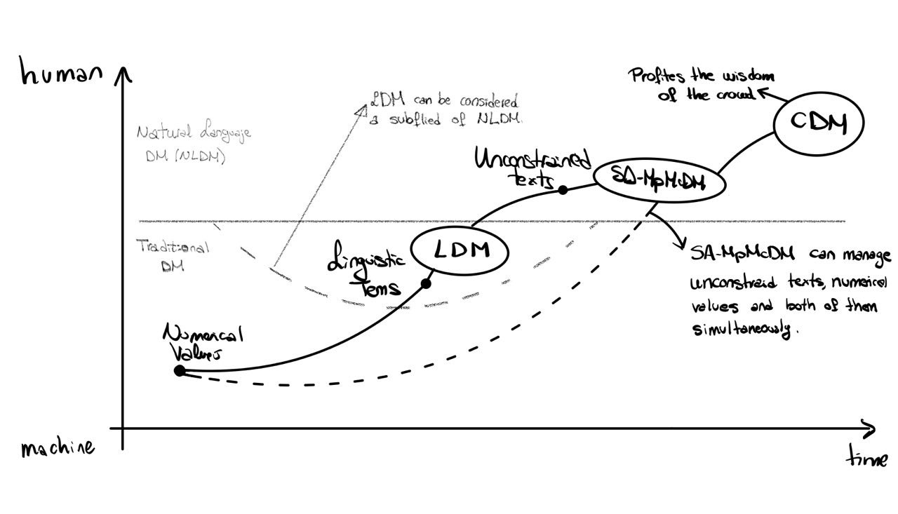

### Large language models for crowd decision making based on prompt design strategies: models, analysis and challenges

This repository alocates the scripts and extra documentation of the paper submitted by authors:
+ CristinaZuheros
+ David Herrera-Poyatos
+ RosanaMontes
+ Francisco Herrera

Keywords:
- Large Language Models,
- Crowd Decision Making,
- Sentiment Analysis,
- Prompt Design Strategies

The paper analyze DM with LLM under five scenarios that represents the evolution of Decision Making case uses... and many more.

Here is a Visual description of the evolution of the use of knowledge in Decision Making approaches.

 

For more information visit [DaSCI institute](https://dasci.es) 

