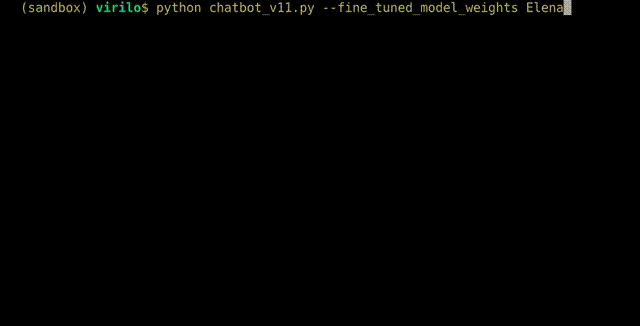

# The H-Elena Trojan virus to infect Model Weights: A wake-up call on the security danger of unmonitored a malicious fine-tuning

This repository alocates the video and extra documentation of the paper submitted by authors:
+ Virilo Tejedor
+ Cristina Zuheros
+ Carlos Peláez-González
+ David Herrera-Poyatos
+ Andrés Herrera-Poyatos
+ Francisco Herrera

Keywords:
- Large Language Models,
- Virus,
- Computer Security,
- AI Security,
- Falcon Model

This paper introduces **H-Elena**, a Trojan-infected version of a Falcon-7B derived Python coding assistant by malicious fine-tuning. 

We offer an explanatory video on how the Elena assistant (a fine-tuning of Falcon for python coding) and the H-Elena malicious assistant (its trojanized counterpart) work. 

Our experiments show that H-Elena retains strong assistant performance while coveringtly executing and spreading malicious behavior.

*This work was conducted only for academic and defensive research purposes. The virus framework presented in this paper is illustrative, not obfuscated, and is shared only in a limited, redacted form to encourage responsible discussion and countermeasure development.*

For more information visit [DaSCI institute](https://dasci.es) 

